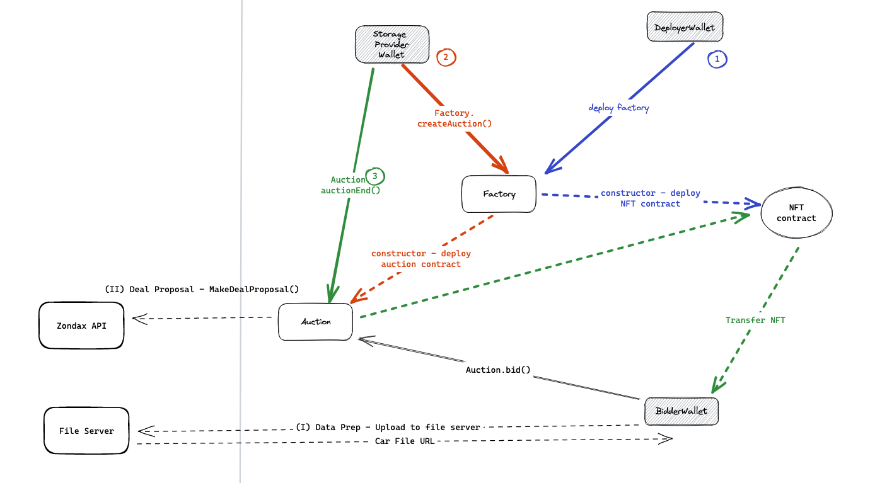

# Setting up the project

## Installing dependencies
Install dependencies
```bash
yarn install
```

## Setting up .env
Replace `.env.exmaple` with `.env`, with the following content:
```bash
PRIVATE_KEY="Your-private-key"
```

## Running tests
In order to run tests: 
```bash
npx hardhat test
```

## Deploying Auction Factory Contract
In order to deploy auction factory contract: 
```bash
npx hardhat run deploy/deploy-auction-factory.js --network Hyperspace
```
-----
# Application Design

## Overview

For this assignment, I worked on 2 different code bases:
- Front-end: https://github.com/YeeeeeHan/starboard-frontend
- Smart-contract: https://github.com/YeeeeeHan/starboard-frontend

Visit the deployed front-end demo here: https://starboard-frontend-git-main-yeeeeehan.vercel.app/. The front-end is created using Next.js, adapted from the [ethereum-boilerplate](https://github.com/ethereum-boilerplate/ethereum-boilerplate) project. 


**Relevant files**:

- Auction Factory and Auction smart contracts: @@@@@@@@@@@@@@@@@@@@@@@@@@@@@@@@@@@@@@@
- NFT smart contract
- Test cases
- Deployment scripts


## Foreword
I would like to preface the fact that I might still be unfamiliar with the whole filecoin ecosystem, but I will work within my best understanding of the ecosystem. Filecoin is a solution to allow clients (bidders) to store files for a fee, and allow storage providers too earn some reward for storing the formers' files. 

However, the current match-making process for clients and storage providers contains some friction, that is, clients will have to identify potential storage providers and go through a price negotation process until both parties agree on the terms of the deal. The deal is then published on-chain. The price discovery process could be replaced with an auction mechanism, where storage providers auction off their storage spaces, and clients bid for the prices they are willing to pay. This allows the market forces to be at play to make the market for efficient. 

Therefore, my understanding of this assignment's requirement is to build an auction system to allow storage providers to create auctions, while allowing clients to put in their bids for the corresponding storage. Upon completion, the system should integrate with the zondax API to streamline the process of deal creation, where the deal is publish on-chain.


## Application Design


The above shows the overview architecture for the auction process. There are 3 main actors in the process: **Deployer**, **Storage Provider**, and **Bidders**. The **Deployer** is involved with deploying the `AuctionFactory` smart contract, which in turn deploys the ERC721 smart contract. There will only be one AuctionFactory smart contract instance, while will be responsible for the creation of subsequent Auction smart contracts. This also means that there will only be 1 ERC721 smart contract deployed, with each additional Auction instance having their own NFT token (i.e. unique TokenID but sharing the same ERC721 smart contract).

The **Storage Provider** will be creating auctions by calling `createAuction(biddingTime)` on the `AuctionFactory` smart contract, which will deploy a new Auction Contract. `biddingTime` is the duration of the auction is ms,  

The **Bidders** will proceed to place bids by calling `bid()` on the `Auction` smart contract. Whenever, there is a higher bid, the `Auction` smart contract will store the address of the highest bidder. The bidder that under-bidded can call `withdraw()` **after the auction ends**, in order to retrieve his under-bid. 


## Factory Contract

## Auction Contract

## NFT Contract

## Requirements

## Test Cases


---------------------------------
## Cloning the Repo

Open up your terminal (or command prompt) and navigate to a directory you would like to store this code on. Once there type in the following command:


```
git clone --recurse-submodules https://github.com/filecoin-project/fevm-hardhat-kit.git
cd fevm-hardhat-kit
yarn install
```


This will clone the hardhat kit onto your computer, switch directories into the newly installed kit, and install the dependencies the kit needs to work.


## Get a Private Key

You can get a private key from a wallet provider [such as Metamask](https://metamask.zendesk.com/hc/en-us/articles/360015289632-How-to-export-an-account-s-private-key).


## Add your Private Key as an Environment Variable

Add your private key as an environment variable by running this command:

 ```
export PRIVATE_KEY='abcdef'
```

If you use a .env file, don't commit and push any changes to .env files that may contain sensitive information, such as a private key! If this information reaches a public GitHub repository, someone can use it to check if you have any Mainnet funds in that wallet address, and steal them!


## Get the Deployer Address

Run this command:
```
yarn hardhat get-address
```

This will show you the ethereum-style address associated with that private key and the filecoin-style f4 address (also known as t4 address on testnets)! The Ethereum address can now be exclusively used for almost all FEVM tools, including the faucet.


## Fund the Deployer Address

Go to the [Hyperspace testnet faucet](https://hyperspace.yoga/#faucet), and paste in the Ethereum address from the previous step. This will send some hyperspace testnet FIL to the account.


## Deploy the Contracts

Currently there are 3 main types of contracts:

* Basic Solidity Examples: Simple contracts to show off basic solidity

* Filecoin API Examples: Contracts that demo how to use the Filecoin APIs in Solidity to access storage deals and other Filecoin specific functions.

* Basic Deal Client: A contract that demos how to create Filecoin storage deals within Solidity smart contracts. See below to learn more.


Type in the following command in the terminal to deploy all contracts:

 ```
yarn hardhat deploy
```

This will compile all the contracts in the contracts folder and deploy them to the Hyperspace test network automatically!

Keep note of the deployed contract addresses for the next step.

## Interact with the Contracts

You can interact with contracts via hardhat tasks, found in the 'tasks' folder. For example, to interact with the SimpleCoin contract:

Type in the following command in the terminal:

 ```
yarn hardhat get-balance --contract 'THE DEPLOYED CONTRACT ADDRESS HERE' --account 'YOUR ETHEREUM ADDRESS HERE'
```

The console should read that your account has 12000 SimpleCoin!

## Filecoin APIs

The primary advantage of the FEVM over other EVM based chains is the ability to access and program around Filecoin storage deals. This can be done in the FEVM via the [Filecoin.sol library maintained by Zondax](https://github.com/Zondax/filecoin-solidity). **Note this library is currently in BETA**. It is unaudited, and the APIs will likely be changing with time. This repo will be updated as soon as possible when a breaking change occurs.

The library is included in this kit as an NPM package and will automatically be downloaded when you perform the `yarn` command (don't confuse these with the included mocks)!

Currently you will find a getter contract that calls the getter methods on the MarketAPI to get storage deal data and store that data. To do this you will need *dealIDs* which you can [find here on FilFox](https://hyperspace.filfox.info/en/deal).

As an example to store most of the data available for a deal run the store-all command with a specified dealID. Below is an example of using this command below with a deal on Hyperspace testnet with a dealID of 707.

```
yarn hardhat store-all --contract "DEPLOYED FILECOIN_MARKET_CONSUMER CONTRACT ADDRESS HERE" --dealid "707"
```

### Preparing Data for Storage

Before storing a file with a storage provider, it needs to be prepared by turning it into a .car file and the metadata must be recorded. To do this, the hardhat kit has a [tool submodule](https://github.com/filecoin-project/fevm-hardhat-kit/tree/main/tools), written in the language Go, which can do this for you. You can also use the [FVM Data Depot website](https://data.lighthouse.storage/) will automatically convert files to the .car format, output all the necessary metadata, and act as an HTTP retrieval point for the storage providers.

### Client Contract - Making Storage Deals in Solidity

Under contracts, within the `basic-deal-client` sub-directory, you will find a file called `DealClient.sol`. This is an example contract that uses the Filecoin.sol API's to create storage deals via Solidity smart contracts on Filecoin. This works by emitting a Solidity event that [Boost storage providers](https://boost.filecoin.io/) can listen to. To learn more about this contract feel free to [checkout the app kit repo](https://github.com/filecoin-project/fvm-starter-kit-deal-making) which includes a detailed readme and a frontend.

### Bounty Contract

Under contracts, within the `filecoin-api-examples` sub-directory, you will find a file called `deal-rewarder.sol`. This is a basic example contract that uses the Filecoin.sol API's to create bounties for specific data to be stored on the Filecoin blockchain. This is intended to be an example to illustrate how you can use the Filecoin APIs to do some cool functionality. To learn more about this contract feel free to [checkout the original Foundry project](https://github.com/lotus-web3/deal-bounty-contract) which includes a detailed readme.