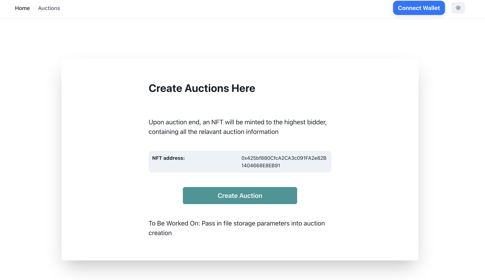
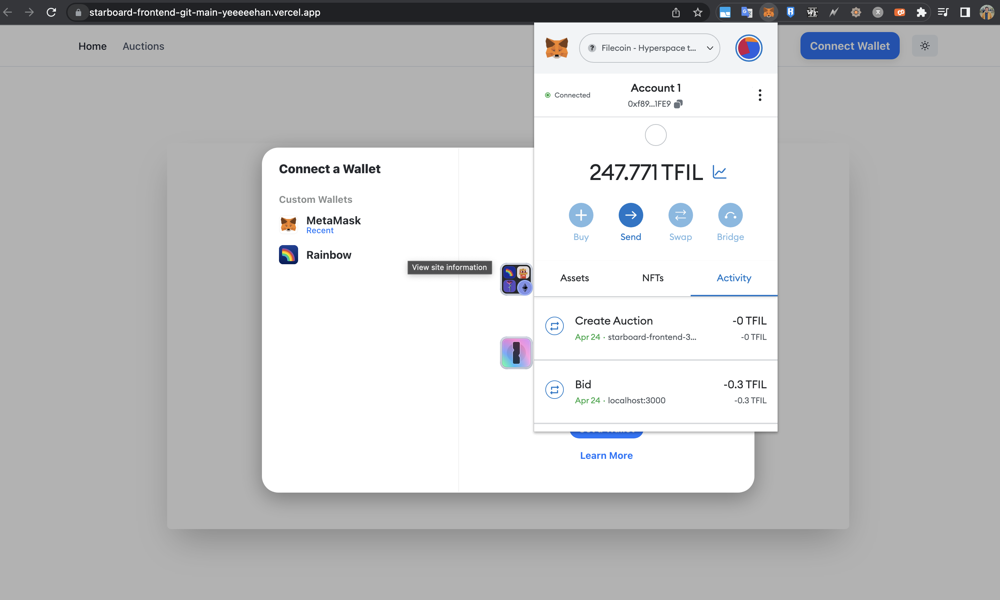
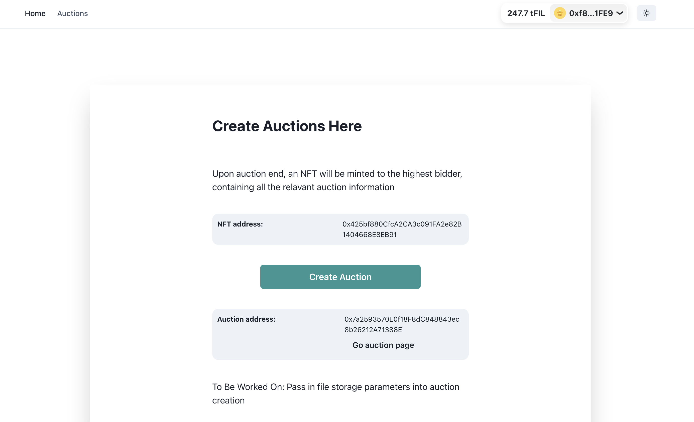
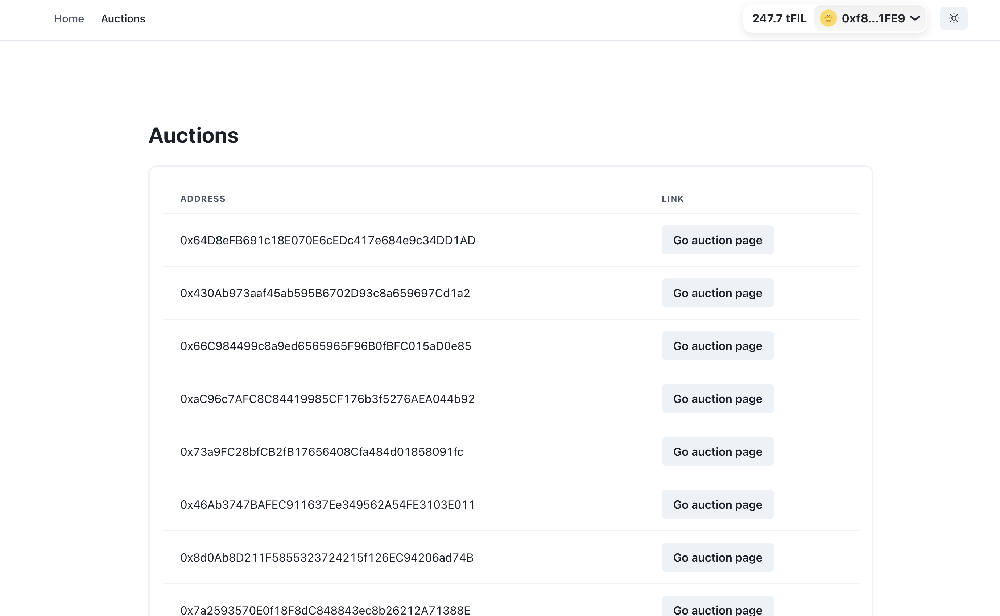
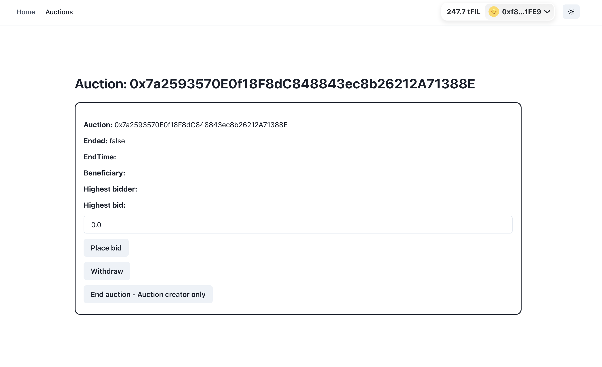

# Setting up the project

## Installing dependencies
Install dependencies
```bash
yarn install
```

## Setting up .env
Replace `.env.exmaple` with `.env`, with the following content:
```bash
PRIVATE_KEY="Your-private-key"
```

## Running tests
In order to run tests: 
```bash
npx hardhat test
```

## Deploying Auction Factory Contract
In order to deploy auction factory contract: 
```bash
npx hardhat run deploy/deploy-auction-factory.js --network Hyperspace
```


# Application Design

## Overview

For this assignment, I worked on 2 different code bases:
- Front-end: https://github.com/YeeeeeHan/starboard-frontend
- Smart-contract: https://github.com/YeeeeeHan/starboard-frontend

Visit the deployed front-end demo here: https://starboard-frontend-git-main-yeeeeehan.vercel.app/. The front-end is created using Next.js, adapted from the [ethereum-boilerplate](https://github.com/ethereum-boilerplate/ethereum-boilerplate) project. 


**Relevant files**:

- Auction Factory and Auction smart contracts: [contracts/SimpleAuction.sol](https://github.com/YeeeeeHan/starboard-auction/blob/main/contracts/SimpleAuction.sol) (Auction contract adapted from [Solidity docs](https://docs.soliditylang.org/en/v0.8.19/solidity-by-example.html#simple-open-auction))
- NFT smart contract: [contracts/AuctionNft.sol](https://github.com/YeeeeeHan/starboard-auction/blob/main/contracts/AuctionNft.sol)
- Test cases: [test/simpleauctionfactory.js](https://github.com/YeeeeeHan/starboard-auction/blob/main/test/simpleauctionfactory.js)
- Deployment script: [deploy/deploy-auction-factory.js](https://github.com/YeeeeeHan/starboard-auction/blob/main/deploy/deploy-auction-factory.js)


## Foreword
I would like to preface the fact that I might still be unfamiliar with the whole filecoin ecosystem, but I will work within my best understanding of the ecosystem. Filecoin is a solution to allow clients (bidders) to store files for a fee, and allow storage providers to earn some reward for storing the formers' files. 

However, there exists some friction within the current match-making process for clients and storage providers, that is, clients will have to identify potential storage providers and go through a price negotation process until both parties agree on the terms of the deal. The deal is then published on-chain. The price discovery process could be replaced with an **auction mechanism**, where storage providers auction off their storage spaces, and clients bid for the prices they are willing to pay. This allows the market forces to be at play to make the market more **efficient**. 

Thus, my understanding of this assignment's requirement is to build an auction system to allow storage providers to create auctions, while allowing clients to put in their bids for the corresponding storage. Upon completion, the system should integrate with the zondax API to streamline the process of deal creation, where the deal is published on-chain.


## Application Design


The above shows the overview architecture for the auction process. There are 3 main actors in the process: **Deployer**, **Storage Provider**, and **Bidders**. The **Deployer** is involved with deploying the `AuctionFactory` smart contract, which in turn deploys the ERC721 smart contract. There will only be one AuctionFactory smart contract instance, where it will be responsible for the creation of subsequent Auction smart contracts. This also means that there will only be one ERC721 smart contract deployed, with each additional Auction instance having their own NFT token (i.e. unique TokenID but sharing the same ERC721 smart contract).

The **Storage Provider** will be creating auctions by calling `createAuction(biddingTime)` on the `AuctionFactory` smart contract, which will deploy a new Auction Contract. `biddingTime` is the duration of the auction in seconds.

The **Bidders** will proceed to place bids by calling `bid()` on the `Auction` smart contract. Whenever, there is a higher bid, the `Auction` smart contract will store the address of the highest bidder. The bidder that under-bidded can call `withdraw()` **after the auction ends**, in order to retrieve his under-bid. 

Finally, once the auction is over (past the biddingTime duration), the **Storage Provider** will be allowed to call `auctionEnd()` on the `Auction` contract. This effectively means that the **Storage Provider** and **Bidder** has agreed on a price, and would procedd to create a deal. Calling `auctionEnd()` will perform 2 actions:

1. Automatically mint an NFT which will contain the auction metadata such as the `highestBid`, `highestBidder`, etc, and transfer the NFT to the highestBidder as proof of winning the auction. I can foresee that a plausible use-case for these NFT would be a secondary market for clients to re-sell their right-to-store-files, where bidders can offer a service to obtain the best prices for less savvy users who want to sit out of the whole price discovery process.
2. Connect with the Zondax API to publish the deal on-chain, via the `makeDealProposal()` in [DealClient.sol](https://github.com/YeeeeeHan/starboard-auction/blob/main/contracts/basic-deal-client/DealClient.sol). (Disclaimer: I did not implement the Zondax API integration because I had trouble deploying the smart contract - it kept returning `Transaction reverted: trying to deploy a contract whose code is too large`)

**(Upon writing this I realised that the under-bids will not be able to be retrieved if the Storage Provider refuses to call `auctionEnd()`, thus some auto-refunding mechanisms should be implemented, i.e. refund if the Auction creator does not call `auctionEnd()` after a fixed duration)*


## Front-end walk through

In order to demonstrate the smart contract interactions, I have decide to implement a front-end. Visit the deployed front-end demo here: https://starboard-frontend-git-main-yeeeeehan.vercel.app/.



* This is the landing page to allow Storage Providers to create an auction.
* The NFT smart contract address is shown.
* Initially, the user's wallet is not conected. They will be required to connect with an appropriate wallet.


* Choose metamask, ensure that the injected browser provider is connected to `Hyperspace`


* Upon auction creation (default 1000s duration - duration passing not implemented), users will be able to see the auction address, and will be prompted to visit the auction page.


* Alternatively, users can navigate to `Auctions` in the header. (Newer auctions will be at the bottom)


* Upon visiting the auction page, users will be presented with this view
* Bidders can place bids or withdraw their bids
* Once auction has expired (current time > EndTime), Storage providers can End the auction
* NFT will be minted and transfered to the highest bidder (Front end for NFT viewing is not implemented)


## Test Cases
- Test cases: [test/simpleauctionfactory.js](https://github.com/YeeeeeHan/starboard-auction/blob/main/test/simpleauctionfactory.js)

## Summary
Personally I enjoyed this assignment and have learnt a lot from the auction mechanism and integrating the smart contracts. One regret is that I did not manage to integrate the Zondax API and smart contracts, to make it a seamless process with reference to the file uploading and deal broadcasting. Nonetheless, I now have a better understanding of the filecoin ecosystem, and I am continually amazed at what other engineers in the space have been achieving, which absolutely inspires me. 
